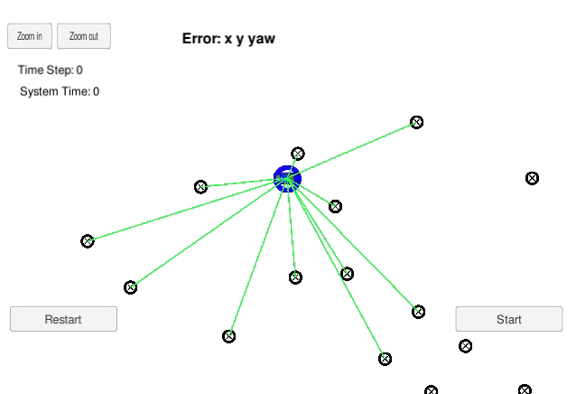

# Kidnapped Vehicle Project
Self-Driving Car Engineer Nanodegree Program

The Project
---

In this project a Particle filter is designed and implemented to solve the localization problem of a moving vehicle inside a map with known landmarks.
The moving vehicle is sensing the environment by measuring the distance from the landmarks.
In the video we see the moving vehicle inside the map and the landmarks as circles. The output of the filter is the blue particle which is the best candidate for the vehicle state estimate (x, y and yaw angle).

In total there are 1000 particles processed in parallel, looking for the best candidate for the vehicle state estimate.

In the initialization, the particles are generated in the surroundings of a state coming from the GPS with a certain noise.

In the prediction step the vehicle is modeled with a bicycle model and noise is added to each particle. Velocity and yaw rate input measurements are used to predict the state of each particle.

In the update step, the weights of all particles are updated in parallel. First the sensor observations, which are x and y position from a landmark in the vehicle
local coordinate system, have to be transformed in the map global coordinate system. Then only the landmarks within the sensor range from the particle state are selected.
Next, for each observation, only one landmark is chosen which is the nearest one. Finally the weight is updated by considering independent associations between each observation and each landmark and calculating the euclidean distance between the observation and the expected observation from the landmark, if the vehicle was in the
specific particle state.

The resample step is the last one, where new particles are generated with a higher probability if they have a higher weight.

In the simulator the error is calculated between the best candidate particle state and the actual state of the vehicle.

Code guidelines
---

The Particle filter code is in the following source file: src/particle_filter.cpp
